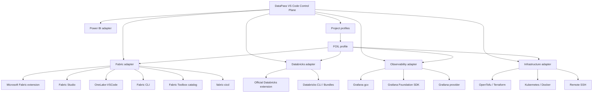

# DataPass VS Code — Data Platform Control Plane

This repository is the implementation home for a **single VS Code control-plane extension** that composes existing data-platform tools instead of forking or replacing them.

It is **not** the Datapass learning Workbench application.

## Product role

One VSIX, modular internal adapters:

## Locked principles

- One extension first. Do **not** create separate Fabric, Power BI or Databricks VSIX packages in Pass 1.
- Adapters integrate existing official/community extensions, CLIs, SDKs and toolbox assets.
- Do not fork vendor client stacks.
- Project-specific context is supplied by project profiles. FOIL is the first pilot.
- Specialized heavy UI may stay external and be launched from VS Code.
- Tool availability must degrade gracefully: missing vendor extensions or CLIs must never make the extension fail to activate.
- Never store credentials, tokens or client secrets in project manifests.
- GitHub repositories remain implementation truth.

## Implementation handoff

Read in order:

1. [handoff/PRO_MASTER_PROMPT.md](handoff/PRO_MASTER_PROMPT.md)
2. [handoff/ARCHITECTURE_LOCK.md](handoff/ARCHITECTURE_LOCK.md)
3. [handoff/SOURCE_MAP.md](handoff/SOURCE_MAP.md)
4. [handoff/PASS1_ACCEPTANCE.md](handoff/PASS1_ACCEPTANCE.md)

Global architecture registry:

- `julian-passebecq/dataprojects/registry/vscode-control-plane.json`
- `julian-passebecq/dataprojects/registry/vscode-tool-catalog.json`

## Current state

Architecture handoff seeded 2026-09-23. Implementation has not yet been accepted into this repository.
