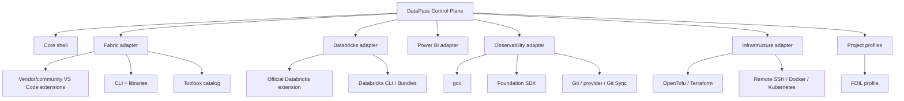

# Architecture Lock — DataPass VS Code

Date: 2026-09-23

## Product boundary

**DataPass VS Code** is a developer control plane for VS Code.

It is not the Datapass learning Workbench, a Fabric clone, a Databricks fork, a Power BI Desktop replacement, a Grafana editor, or a project database.

## Packaging

Pass 1 ships **one VSIX**.

Platform domains are internal adapters/modules. A separate VSIX is allowed only later if there is a concrete independent distribution, runtime/dependency, security/authentication or release-lifecycle reason.

## Composition model



## Core responsibilities

The core shell owns Activity Bar, Galaxy/home UI, adapter registry, tool detection, project selector/profile registry, safe command dispatch, status model, configuration, and exportable local handoff/status.

The core shell does not own vendor API implementations unless a small supported API call is clearly needed and there is no better supported client/CLI.

## Adapter boundary

Adapters should converge on a small common interface:

```ts
interface PlatformAdapter {
  id: string;
  displayName: string;
  detect(ctx: DetectionContext): Promise<PlatformStatus>;
  getActions(ctx: ProjectContext): Promise<PlatformAction[]>;
  execute(actionId: string, ctx: ProjectContext): Promise<ActionResult>;
}
```

Exact names are not locked. The boundary is.

## Manifest-driven tool catalog

Toolbox/catalog entries should be data, not hard-coded UI branches.

```json
{
  "id": "fabric-security-audit",
  "domain": "fabric",
  "name": "Fabric Security Audit",
  "source": "microsoft/fabric-toolbox",
  "kind": "powershell_tool",
  "actions": ["read", "configure", "run"],
  "requirements": ["pwsh", "local:fabric-toolbox"]
}
```

## Fabric lock

```text
DataPass Fabric adapter
  -> Microsoft Fabric VS Code extension
  -> Fabric Studio
  -> OneLake-VSCode
  -> Fabric CLI
  -> fabric-cicd
  -> curated Microsoft Fabric Toolbox assets
  -> Fabric Extensibility Toolkit only for a Fabric-native workload
```

Use existing VS Code UIs when strong. Add UI around project orchestration or tools that lack a useful VS Code surface.

## Databricks lock

```text
DataPass Databricks adapter
  -> official Databricks VS Code extension
  -> Databricks CLI
  -> Asset Bundles
  -> project repos such as foil_databrick_dab
```

The historical `databricks-vscode-foil` fork is reference-only.

## Power BI lock

VS Code is appropriate for PBIP, TMDL/PBIR, Git, validation, automation, agentic workflows, and launch/integration of specialized tools.

Advanced model/report editing can remain in specialized external applications where that is materially better.

## Observability lock

Grafana is integrated as code:

```text
typed dashboard source
 -> Foundation SDK
 -> gcx dev serve
 -> Git
 -> gcx / Git Sync / OpenTofu or Terraform Grafana provider
```

Do not build a custom dashboard designer.

## Infrastructure lock

OpenTofu/Terraform/Kubernetes/Docker/Remote SSH remain peer tools. DataPass provides project-aware status and actions, not replacement clients.

## Project profiles

Profiles bind generic adapters to a concrete project. FOIL is profile #1.

A project profile points to authoritative repos/configuration and supplies workflow context. It cannot silently become engineering truth.

## Authority / persistence

- Code and extension behavior: this repository.
- Global portfolio/tool architecture: `julian-passebecq/dataprojects`.
- Project implementation: owning project repositories.
- FOIL durable engineering/project truth: existing FOIL authorities, not this extension.
- Extension local state: only local bindings/preferences/status cache.

## Security

Never store secrets in profile JSON or source-controlled extension settings.

Use vendor auth and explicit user-triggered mutation. Use VS Code secret storage only if a future feature truly requires local secret persistence.

## Degradation rule

Every integration must have:

1. supported/detected;
2. missing/unconfigured with actionable guidance;
3. upstream interface changed/unavailable with safe fallback.

No peer extension or CLI is allowed to be a hard activation dependency unless explicitly justified.
